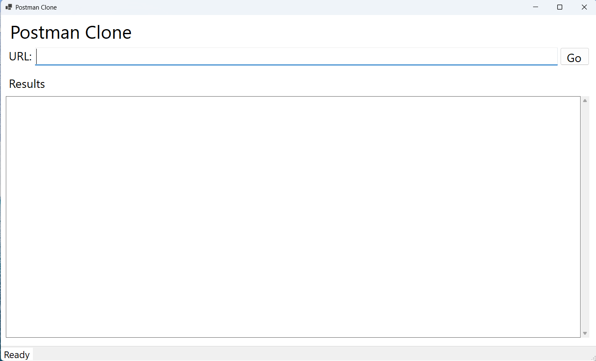
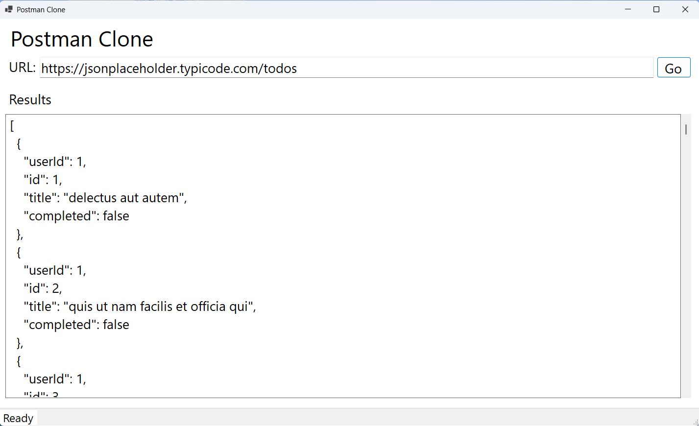

# PostmanClone

A lightweight desktop application for making HTTP requests and viewing API responses in a clean, formatted interface. Built to explore and reinforce fundamental concepts of API consumption, HTTP communication, and Windows Forms development.

## 🎯 About The Project
PostmanClone is a study-focused tool that simulates core API client functionality, supporting the main HTTP methods (GET, POST, PUT, PATCH, DELETE) and presenting responses in a readable, formatted JSON view.

This project was created to deepen understanding of:

REST API consumption patterns

HTTP request/response handling

JSON parsing and formatting

Windows Forms desktop development

Clean code organization practices

## 🚀 Features
Full support for HTTP methods: GET, POST, PUT, PATCH, and DELETE

Clean and intuitive user interface

Formatted JSON response viewer

Clear visual feedback on request status

Basic URL validation

Self-contained executable - no runtime installation required

## 🛠️ Technologies Used
C# - Primary programming language

.NET 8 - Application framework

Windows Forms - Desktop UI framework

HttpClient - HTTP request handling

## 📋 How to Use
Quick Start
Download the latest executable from the Releases section

Run the downloaded file - no .NET runtime installation needed (self-contained publish)

Start making API requests immediately!

Building from Source
If you prefer to compile the code yourself:

Clone this repository

Open the solution in Visual Studio 2022 or later

Build and run the project

## Usage Guide
When launched, the application window will appear:

## To make an API request:

Enter the complete API URL in the address field

Select the desired HTTP method from the dropdown

Click the "Go" button

View the formatted response:

## 💡 Key Learnings
This project provided hands-on experience with:

Implementing HTTP communication using HttpClient

Handling various HTTP status codes and response types

JSON serialization and deserialization

Building functional desktop interfaces with WinForms

State management in desktop applications

Self-contained .NET application deployment

## 🔮 Future Improvements
Potential enhancements being considered:

Custom headers support

Request history with local storage

Authentication methods (Bearer token, Basic auth)

Custom request body editor

Response export functionality

Dark/Light theme toggle

## ⚡ Performance Notes
The application is published as a self-contained executable, meaning:

No .NET runtime installation required on the target machine

Slightly larger file size (includes necessary framework components)

Works on any compatible Windows system out of the box

